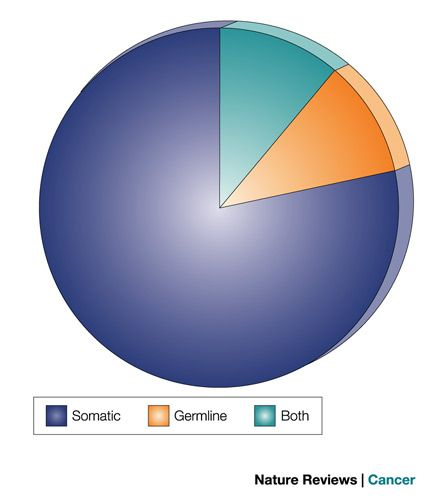

# Cancer Gene Census
Gene level data from the cancer genome census covering gene's relation to somatic/germline
tumors and tissue types.

The Cancer Gene Census (CGC) is an ongoing effort to catalogue those genes which contain mutations that have been causally implicated in cancer. The original census and analysis was published in Nature Reviews Cancer.

The census is not static, instead it is updated when new evidence comes to light.

 
