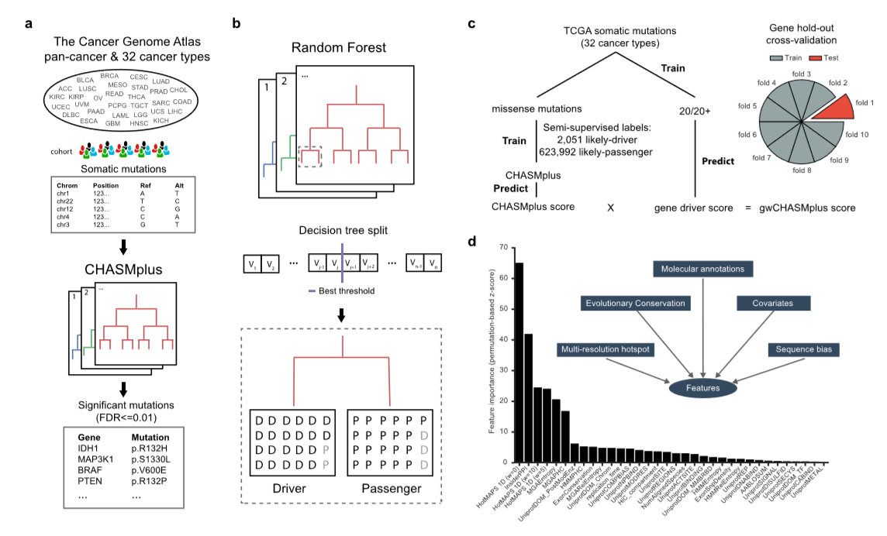
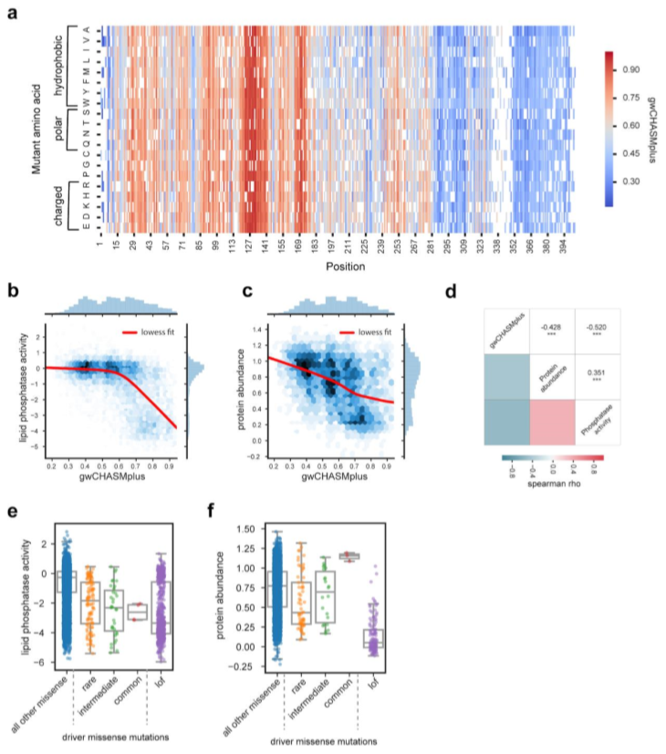

 
CHASMplus is random forest classifier trained to distinguish between benign and somatic missense mutations.

Large-scale cancer sequencing studies of patient cohorts have statistically implicated many cancer driver genes, with a long-tail of infrequently mutated genes. Here we present CHASMplus, a computational method to predict driver missense mutations, which is uniquely powered to identify rare driver mutations within the long-tail. We show that it substantially outperforms comparable methods across a wide variety of benchmark sets. Applied to 8,657 samples across 32 cancer types, CHASMplus identifies over 4,000 unique driver mutations in 240 genes, further distinguished by their specific cancer types. Our results support a prominent emerging role for rare driver mutations, with substantial variability in the frequency spectrum of drivers across cancer types. The trajectory of driver discovery may already be effectively saturated for certain cancer types, a finding with policy implications for future sequencing. As a resource to handle newly observed rare driver mutations, we systematically score every possible missense mutation across the genome.
