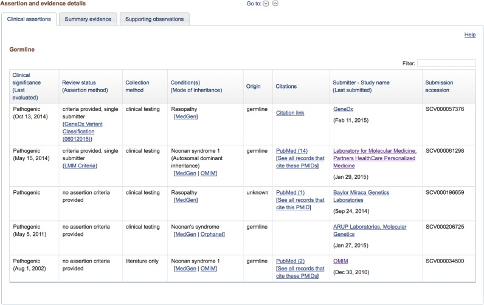

# ClinVar: public archive of interpretations of clinically relevant variants
ClinVar is a freely accessible, public archive of reports of the relationships among human variations and phenotypes, with supporting evidence. 
 
Clinical Significance includes:  
Benign, Likely benign, Uncertain significance, Likely pathogenic, Pathogenic, Drug response, Association, Risk factor, Protective, Affects, Conflicting data from submitters, Other and Not provided
 
Review Status is the level of review supporting the assertion of clinical significance for the variation. There are 8 different statuses to consider, ranked from highest to lowest levels of review: 
1. Practice Guideline
2. Reviewed by expert panel 
3. Criteria provided, multiple submitters, no conflicts 
4. Criteria provided, conflicting interpretations
5. Criteria provided, single submitter
6. No assertion for the individual variant 
7. No assertion criteria provided
8. No assertion provided

See https://www.ncbi.nlm.nih.gov/clinvar/docs/review_status/ for more information. 

 
 