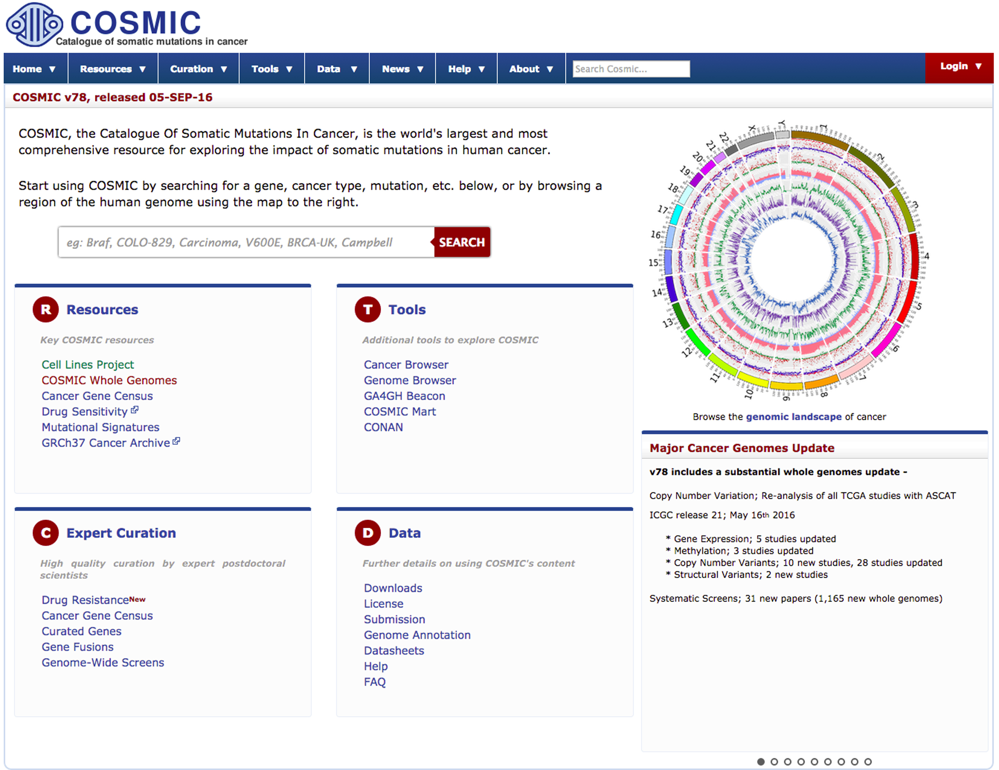
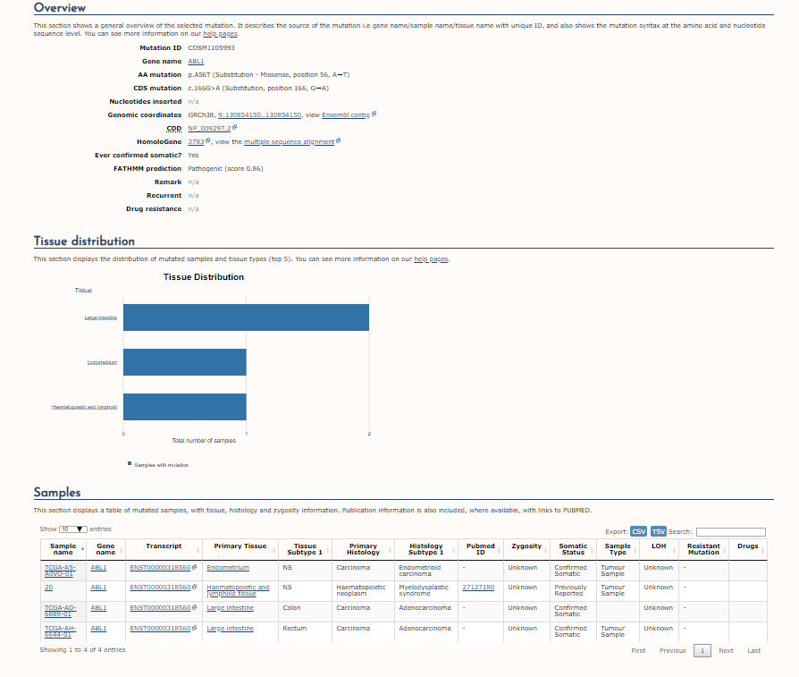

# COSMIC: Catalogue of Somatic Mutations in Cancer 
COSMIC, the Catalogue of Somatic Mutations in Cancer is a high-resolution resource for exploring targets and trends in the genetics of human cancer. Currently the broadest database of mutations in cancer, the information in COSMIC is curated by expert scientists, primarily by scrutinizing large numbers of scientific publications.  COSMIC now details the genetics of drug resistance, novel somatic gene mutations which allow a tumour to evade therapeutic cancer drugs.  All information from the COSMIC database is available freely on the COSMIC website.

 