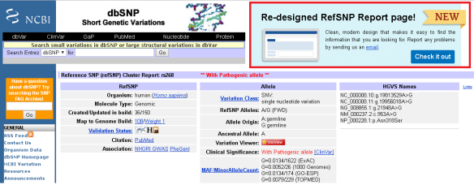
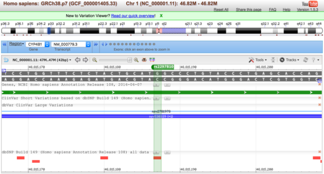
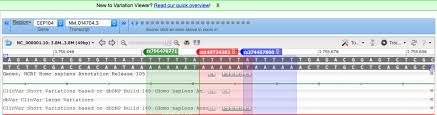

#dbSNP - Single Nucleotide Polymorphism Database
The Single Nucleotide Polymorphism Database (dbSNP) is a free public archive for genetic variation within and across different species developed and hosted by the National Center for Biotechnology Information (NCBI) in collaboration with the National Human Genome Research Institute (NHGRI). Although the name of the database implies a collection of one class of polymorphisms only (i.e., single nucleotide polymorphisms (SNPs)), it in fact contains a range of molecular variation: SNPs, short deletion and insertion polymorphisms (indels/DIPs),  microsatellite markers or short tandem repeats (STRs), multinucleotide polymorphisms (MNPs), heterozygous sequences, and named variants. The dbSNP accepts apparently neutral polymorphisms, polymorphisms corresponding to known phenotypes, and regions of no variation.

 