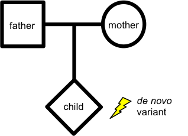

## Denovo

 
denovo-db is a collection of germline de novo variants identified in the human genome. *de novo* variants are those present in children but not their parents.

With the advancements in whole-exome and whole-genome sequencing we are now able to assess 1000s of these variants. To provide a landing place for de novo variation we created denovo-db, which has been assembled using the published literature.

Many large exome and genome studies have focused on neurodevelopmental disorders and while we are very interested in these disorders we have not limited our database to only these phenotypes.

The information types present in denovo-db have been refined to include what we think is highly relevant for genetic studies (for example basic functional annotation, CADD scores, and validation status).

Our goal is to provide a compendium of all de novo variants to benefit the larger researcher community.