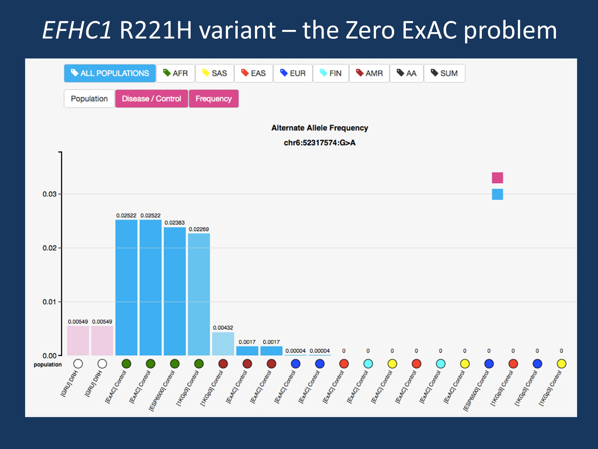

# ESP6500 - Exome Sequencing Project (ESP)
The goal of the NHLBI GO Exome Sequencing Project (ESP) is to discover novel genes and mechanisms contributing to heart, lung and blood disorders by pioneering the application of next-generation sequencing of the protein coding regions of the human genome across diverse, richly-phenotyped populations and to share these datasets and findings with the scientific community to extend and enrich the diagnosis, management and treatment of heart, lung and blood disorders.

 
When looking at smaller cohorts largely of European ancestry, a variant may be absent, which is one of the prerequisites of calling the variant pathogenic. However, when compared to the full ESP6500 and ExAC dataset, we can see that this variant is actually present at a comparable frequency in individuals for African ancestry.