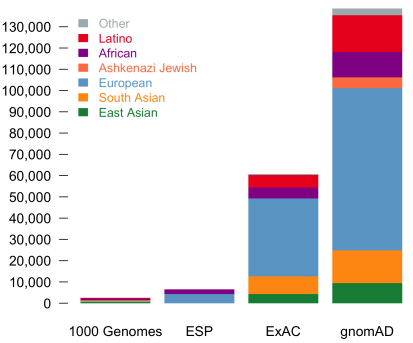

# gnomAD - genome Aggregation Database
The Genome Aggregation Database is a resource developed by an international coalition of investigators, with the goal of aggregating and harmonizing both exome and genome sequencing data from a wide variety of large-scale sequencing projects, and making summary data available for the wider scientific community.
Full genome snp and indel variant frequencys for many populations.

 