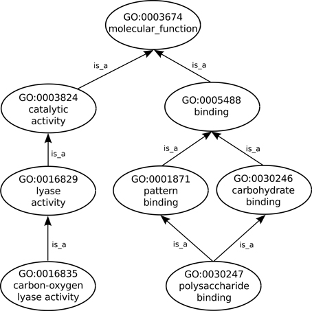
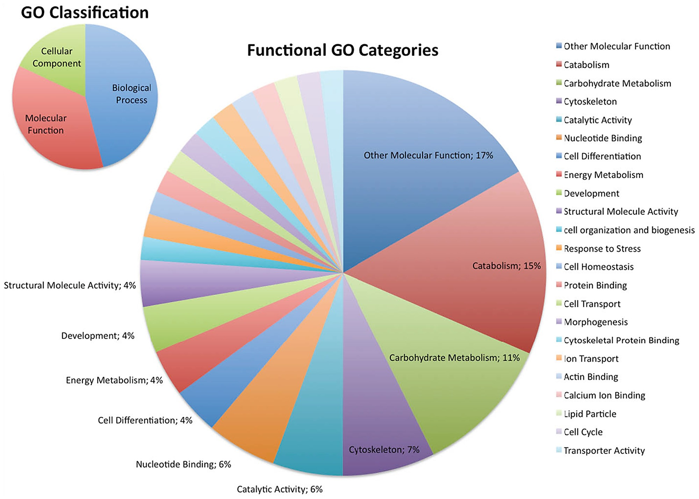

# Gene Ontology
The Gene Ontology (GO) project provides the most comprehensive resource currently available for computable knowledge regarding the functions of genes and gene products. GO defines concepts/classes used to describe gene function, and relationships between these concepts. It classifies functions along three aspects: molecular function (MFO), molecular activities of gene products; cellular component (CCO), where gene products are active; and biological process (BPO), pathways and larger processes made up of the activities of multiple gene products.

 
