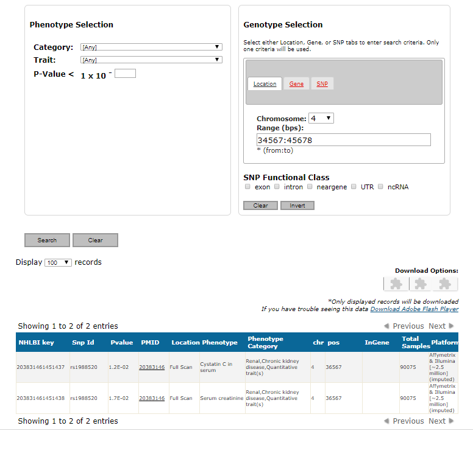

# GRASP/GWAS - Genome-Wide Repository of Associations Between SNPs and Phenotypes

GRASP includes all available genetic association results from papers, their supplements and web-based content meeting the following guidelines:
- All associations with P<0.05 from GWAS defined as >= 25,000 markers tested for 1 or more traits.
- Study exclusion criteria: CNV-only studies, replication/follow-up studies testing <25K markers, non-human only studies, article not in English, gene-environment or gene-gene GWAS where single SNP main effects are not given, linkage only studies, aCGH/LOH only studies, heterozygosity/homozygosity (genome-wide or long run) studies, studies only presenting gene-based or pathway-based results, simulation-only studies, studies which we judge as redundant with prior studies since they do not provide significant inclusion of new samples or exposure of new results (e.g., many methodological papers on the WTCCC and FHS GWAS).

 