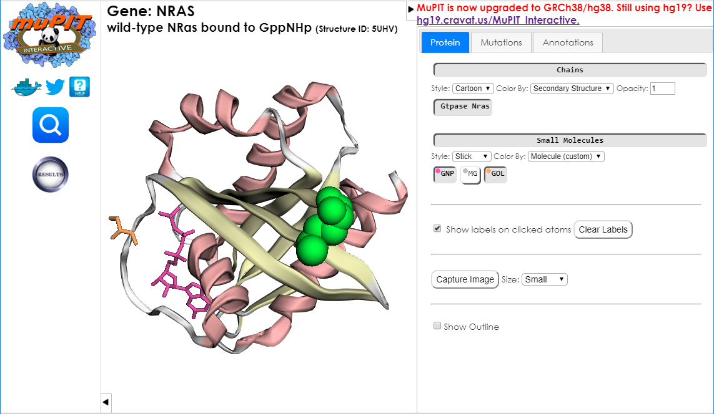

# muPIT - Mutation Position Imaging Toolbox 

Maps the genomic coordinates of single-nucleotide variants (SNVs) onto the coordinates of available three-dimensional (3D) protein structures. The MuPIT application is designed for interactive browser-based visualization of the putative functional relevance of SNVs by biologists who are not necessarily experts either in bioinformatics or protein structure.

 