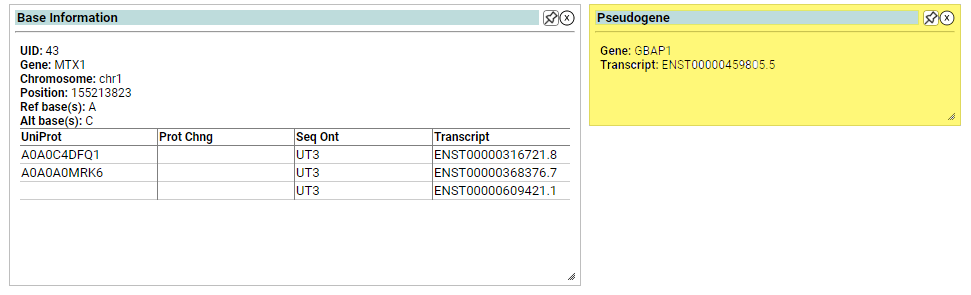

# Pseudogene
The GENCODE Genes track (version 28, Apr 2018) shows high-quality manual annotations merged with evidence-based automated annotations across the entire human genome generated by the GENCODE project. The GENCODE gene set presents a full merge between HAVANA manual annotation process and Ensembl automatic annotation pipeline. Priority is given to the manually curated HAVANA annotation using predicted Ensembl annotations when there are no corresponding manual annotations. The 28 annotation was carried out on genome assembly GRCh38 (hg38).

GENCODE Pseudogenes include all annotations except polymorphic pseudogenes.

 