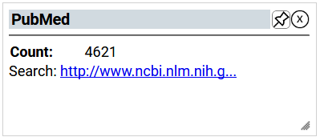

# PubMed

The number of PubMed articles that mention a given gene in the title or abstract, and a link to those articles.

 

PubMed comprises more than 28 million citations for biomedical literature from MEDLINE, life science journals, and online books. Citations may include links to full-text content from PubMed Central and publisher web sites.