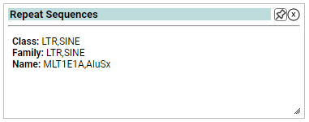

# Repeat Sequences

## Overview
 
Learn whether your module falls into a repeat region.

This can be useful for knowing if you're in a reasonable complexity region.

## Outputs

- Repeat Class: The class of repeat
- Repeat Family: The family of repeat
- Repeat Name: The specific name of the repeat

 