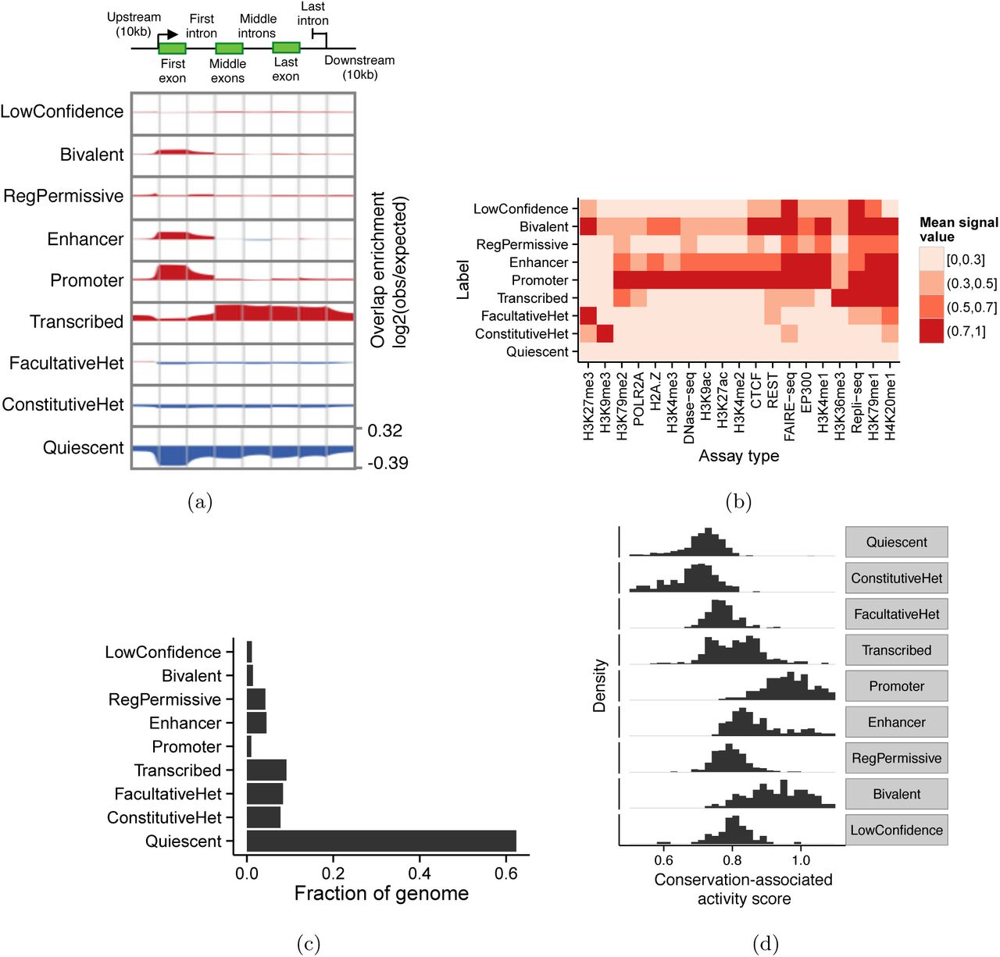

# Segway encyclopedia of human regulatory elements

## All Tissues

Chromatin state annotations of 164 human cell types using 1,615 genomics data sets were used to develop a measure of the importance of each genomic position called the "conservation-associated activity score". The aggregated conservation-associated activity score, aggregated across multiple cell types, provide a measure of importance directly attributable to a specific activity in a specific set of cell types. In contrast to evolutionary conservation, this measure is not biased to detect only elements shared with related species. The conservation-associated activity score for all annotations were combined to create a single, cell type-agnostic encyclopedia that catalogs all human transcriptional and regulatory elements. 

## Interpreting scores

Each base pair has a aggregated conservation-associated activity score (renamed from "functionality score"). Mean Score and Sum Score are the mean and sum within the segment containing the query variant. The conservation-associated activity score is defined based on the enrichment of each annotation state for evolutionary conservation, and therefore aims to separate functional activity (such as genes, promoters and enhancers) from non-functional activity (repressed regions).

Higher scores are associated with increased functional activity. The figure below may help interpret score values.

