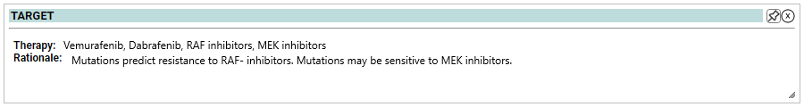

# Target - Tumor Alterations Relevant for GEnomics-driven Therapy

TARGET is a database of genes that, when somatically altered in cancer, are directly linked to a clinical action. TARGET genes may be predictive of response or resistance to a therapy, prognostic, and/or diagnostic.

TARGET is intended to be a community resource for translational oncology.  To maintain relevance and keep pace with new preclinical and clinical discoveries, it is updated quarterly.