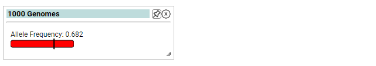

# Thousand Genomes

Allele frequency across 1K genomes. From http://www.internationalgenome.org/

 
The 1000 Genomes Project set out to provide a comprehensive description of common human genetic variation by applying whole-genome sequencing to a diverse set of individuals from multiple populations.

 
