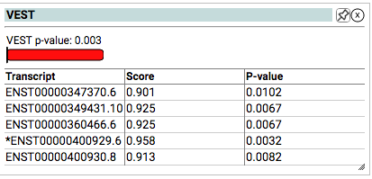

# VEST

A machine learning method that predicts the functional significance of missense mutations based on the probability that they are pathogenic. Precomputed across the entire exome for rapid annotation.

 

http://karchinlab.org/apps/appVest.html