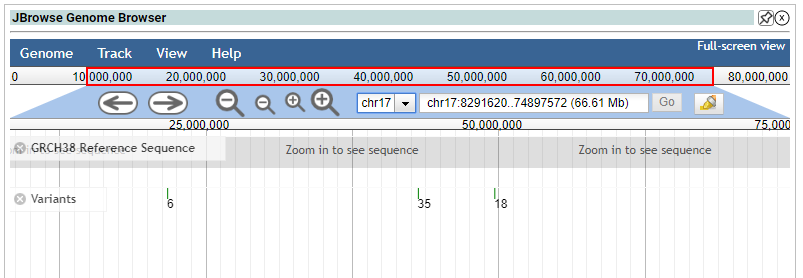

# JBrowse Summary Widget

JBrowse is a fast, scalable genome browser built completely with JavaScript and HTML5. It can run on your desktop, or be embedded in your website.

JBrowse in openCRAVAT is used to visualize how your mutations are distributed within the genome. It can help you find locations where your mutations are clustered.

